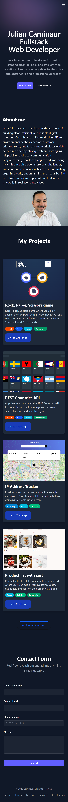

# Landing Page – Personal Portfolio

This repository contains my personal landing page, built to showcase my work and provide a simple way for people to contact me.

## Technologies Used

- React
- TailwindCSS
- Radix UI (Toast)
- Vite

## Features

- Contact form with client-side validation
- Success and error notifications using Radix Toast
- Responsive design for mobile and desktop
- Clean and minimal UI

## Backend

A small backend is being developed using Laravel 11 to support:

- Email sending from the contact form
- Server-side validation
- SMTP integration (Mailtrap for development)
  The backend will function as a lightweight API separate from the frontend.

#### Desktop

#### Mobile

## Project Goals

- Improve professional online presence
- Practice and solidify React + Tailwind skills
- Add real, complete projects to my GitHub
- Build a foundation for a full personal portfolio
