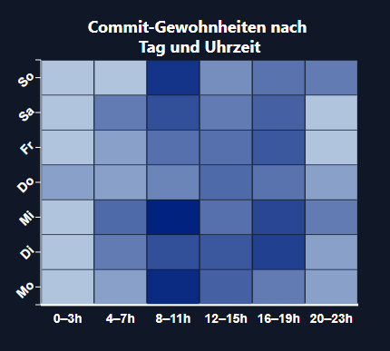
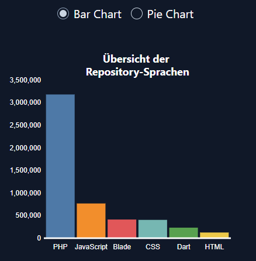
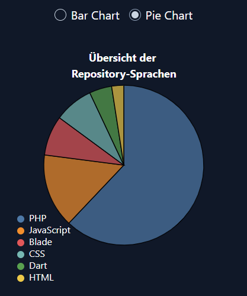

# Landing Page – Personal Portfolio

This repository contains my personal landing page, built to showcase my work and provide a simple way for people to contact me.

## Technologies Used

- React
- TailwindCSS
- Radix UI (Toast)
- Vite

## Features

- Contact form with client-side validation
- Success and error notifications using Radix Toast
- Responsive design for mobile and desktop
- Clean and minimal UI

## Analytics & Charts

The application includes analytics charts whose data is provided by the backend.

- Charts are generated from data fetched via the GitHub API
- The backend processes and aggregates this data
- Metrics are automatically updated on a daily basis
- The frontend consumes this data through the backend API

## Backend

A small backend is being developed using Laravel 11 to support:

- Email sending from the contact form
- Server-side validation
- SMTP integration (Mailtrap for development)
  The backend will function as a lightweight API separate from the frontend.

## Deployment & CI/CD

The project uses different deployment strategies for the frontend and backend,
each aligned with its specific requirements.

### Frontend

- Automated CI/CD pipeline using GitHub Actions
- Triggered on every push to the `main` branch
- Installs dependencies and builds the Vite project
- Deploys the production build to Hostinger via FTP
- Ensures consistent and repeatable deployments

### Backend

- Deployed using Hostinger’s GitHub integration
- Connected directly to the GitHub repository
- Automatically deployed on every push to the `main` branch
- No manual deployment steps required
- Deployment pipeline managed by the hosting provider

#### Desktop

#### Mobile

## Project Goals

- Improve professional online presence
- Practice and solidify React + Tailwind skills
- Add real, complete projects to my GitHub
- Build a foundation for a full personal portfolio
